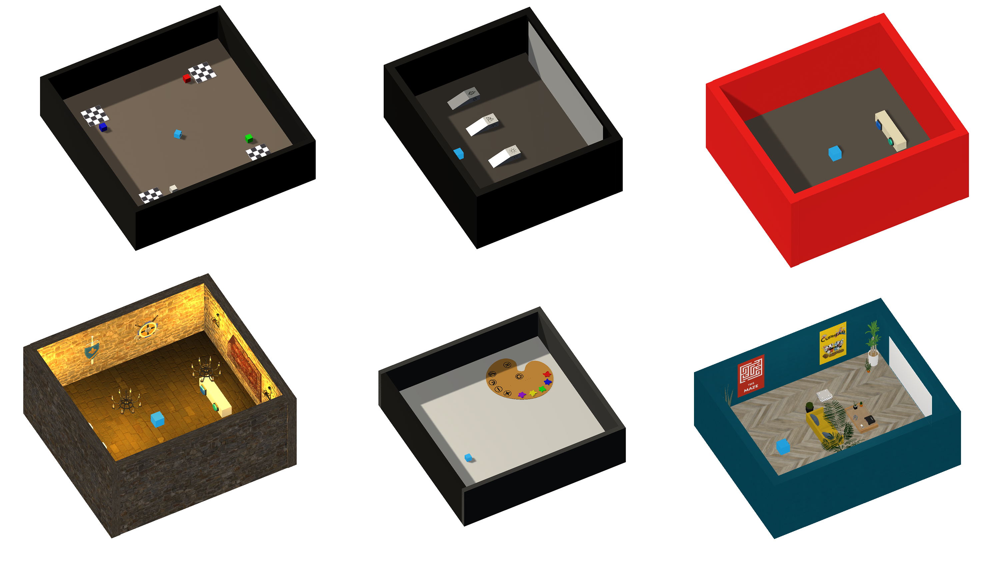

  
  

# Unity ML-Agents Environments for Curiosity Learning

**The Flowers team of Inria Bordeaux works on Curiosity Learning algorithms**. These algorithms are usually used in environments without extrinsic rewards. But this kind of environment is difficult to find. The Unity Machine Learning Agents Toolkit (ML-Agents) allowed us to design environments that meet our expectations.

We designed 6 new environments (in addition to the ML-Agents environments) where an agent can explore and interact with it environment. These environments do not have any goal to achieve or script to follow. This deposit was created for researchers that would train their agents in other environments than those developped by ML-Agents. 

According to the environment, you receive informations at each step of your simulation as the position of the agent, the state of a switch, etc. Moreover, you can easily reset the environments with new characteristics.

If you download this deposit, you can only work on the environments already build or change the environments with the software Unity.

## Features

* Unity environments controlled by Python Algorithms

* 6 new Unity environments

* 16 ML-Agents sample Unity environments

* No extrinsic reward

* New environments designed with Unity 2018.4.2f1 version

* ML-Agents 0.7 version

* Linux & Mac only

* Python 3.6 version

* Jupyter Notebook

* The agent give a renderer of the scene through a camera (picture 84x84)

* Discrete Actions 

* Interact with the environments through the wrapper `gym`

* Pre-configured brain to try manually the environments (Unity only)

* Easy way to add informations in a dictionary (Unity only)

* Error message if you try to reset the environment with a wrong parameter

  

## Documentation

* For more information, in addition to installation and usage instructions, see
  our [documentation home](docs/Home.md).
  
* If you only want to use the new environments with Gym, see the first part of the documentation

* If you want to change the new or the old environments with Unity (add elements or informations, set up the reset, test manually, etc.) see the second part of the documentation
  
* If you want to learn more about ML-Agents, see the last part of the documentation
  
  

## Contact

We used the open-source project ML-Agents and designed our environments with the software Unity. If you have questions about how work these toolkits you can read the [ML-Agents documentation](docs/ML-Agents_documentation/README.md).

If you want to learn more about the Flowers Team of Inria Bordeaux Sud-Ouest, go on our [web site](https://flowers.inria.fr/).
