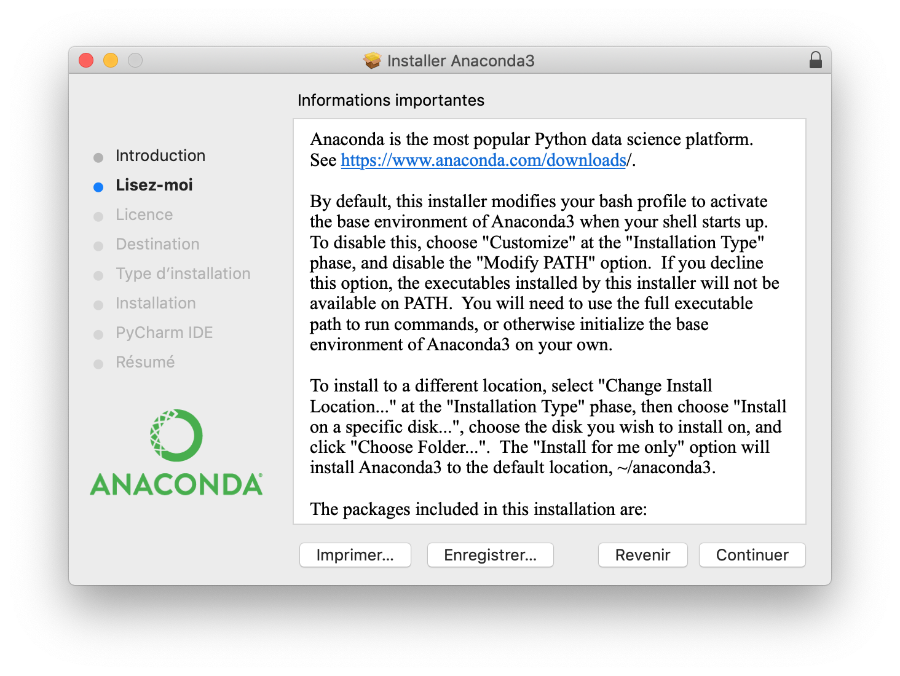

# Installation : Anaconda (part 1/2)

To use the new environments, you need to install ML-Agents via an Anaconda virtual environment and  launch (or create) a notebook.

Each of the subsections below guides you step by step.

Come back to [home](Home.md)

### Contents

* [Install Anaconda](#install_anaconda)

* [Mac User](#mac_user)

* [Unix User](#unix_user)

* [Virtual Environment creation](#virtual_environment)

* [Next Step](#next_step)

  

## <a name="install_anaconda">Install Anaconda</a>

[Download](https://www.anaconda.com/distribution/) Anaconda with Python 3.7 version for your operating system.


<p align="center">
  
</p>


## <a name="mac_user">Mac Users</a>

### Installation procedure

Double-click the downloaded file and click continue to start the installation.

<p align="center">
  
</p>

Answer the prompts on Read Me and License screens.

<p align="center">
  
  
</p>

Click the Install button to install Anaconda in your home user directory (recommended).

<p align="center">
  
</p>

Do not install Anaconda with PyCharm and click the Continue button.

<p align="center">
  
</p>

A successful installation displays the following screen:

<p align="center">
  
</p>

## <a name="unix_user">Unix Users</a>

###Installation procedure

1. Run the Anaconda script

```bash
$ bash Anaconda3-2019.03-Linux-x86_64.sh
```

You’ll receive the following output to review the license agreement by pressing `ENTER` until you reach the end.

```bash
Output

Welcome to Anaconda3 2019.03

In order to continue the installation process, please review the license
agreement.
Please, press ENTER to continue
>>>
...
Do you approve the license terms? [yes|no]
```

When you get to the end of the license, type `yes` as long as you agree to the license to complete installation.

Once you agree to the license, you will be prompted to choose the location of the installation. You can press `ENTER` to accept the default location, or specify a different location.

```bash
OutputAnaconda3 will now be installed into this location:
/home/sammy/anaconda3

  - Press ENTER to confirm the location
  - Press CTRL-C to abort the installation
  - Or specify a different location below

[/home/sammy/anaconda3] >>>
```

At this point, the installation will proceed. Note that the installation process takes some time.

Once installation is complete, you’ll receive the following output:

```bash
Output...
installation finished.
Do you wish the installer to prepend the Anaconda3 install location
to PATH in your /home/sammy/.bashrc ? [yes|no]
[no] >>> 
```

It is recommended that you type `yes` to use the `conda` command.

You can now activate the installation with the following command:

```bash
source ~/.bashrc
```

Use the `conda` command to test the installation and activation:

```bash
conda list
```

You’ll receive output of all the packages you have available through the Anaconda installation.

It is recommended that you update Anaconda with the command :

```bash
conda update --all
```


## <a name="virtual_environment">Virtual Environment creation (for all)</a>

You have to create an Anaconda environments with the `conda create` command. Create a Python 3.6 environment named `ml-agents` with the following command:

```bash
conda create --name ml-agents python=3.6
```

Activate the new environment like so:

```bash
conda activate ml-agents
```

**Notes:**

- ML-Agents does not currently support Python 3.7 or Python 3.5.


## <a name="next_step">Next Step</a>

How to install [ML-Agents](ML-Agents_Install.md) & Gym-Unity in our virtual environment

or come back to [home](Home.md)

