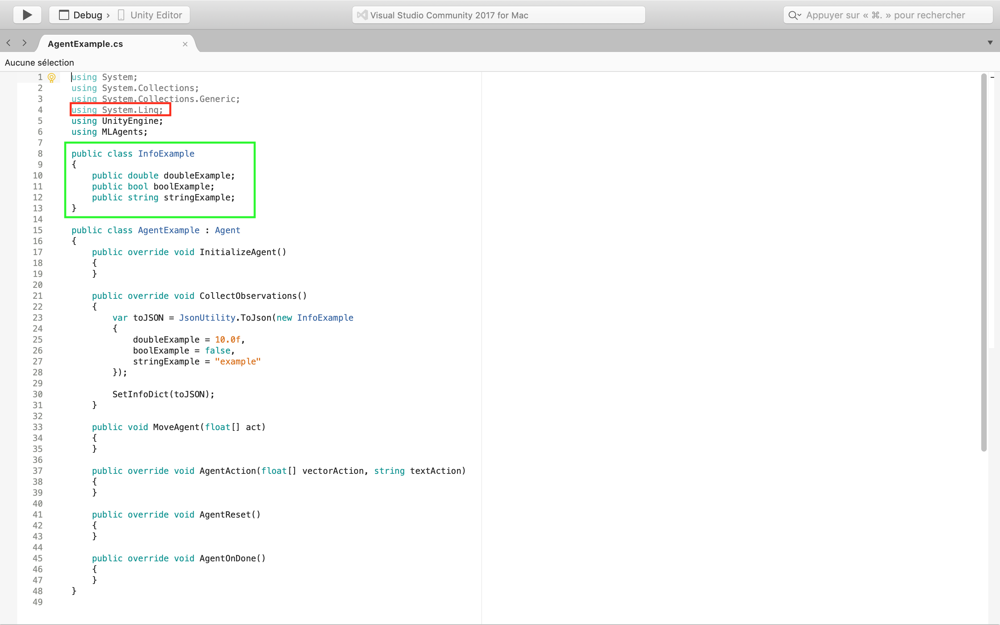
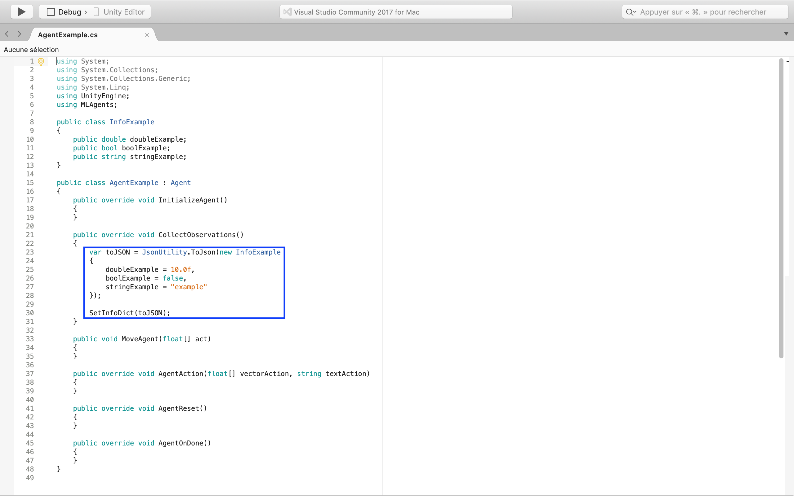
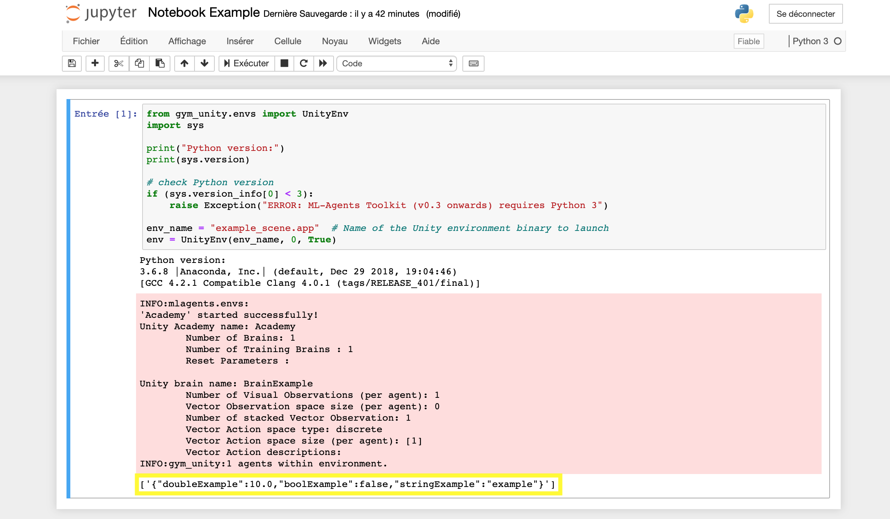

# Add informations in the dictionary

We have chosen to simply the way to add informations in the ML-Agents dictionary. Instead of use the protocol buffers and add each of new informations, we serialized these informations and send it in the dictionary where they are deserialized. Then, the only script you have to change is the script of the agent extending the Agent class.

Come back to [home](Home.md)

### Contents

- [Create a class with the Serializable attribute ](#class)

- [Convert to Json and send the class](#convert)

- [Result in Gym-Unity](#result)

- [Next Steps](#next_steps)

  

## <a name="class">Create a class with the Serializable attributes</a>

The first step is to add, in the script of the agent extending the Agent class, the namespace `System.Linq` which allows to use the serialization in Unity : **red block**. Then, create a class with the serializable attribute : **green block**. In our example, our class has three kind of serializable variables : `doubleExample` : *double*, `boolExample` : *boolean* and `stringExample` : *string*. If you want more information about *JsonUtility* visit this [website](https://docs.unity3d.com/ScriptReference/JsonUtility.html).

  

##<a name="convert">Convert to Json and send the class</a>

The next step is to add in the `CollectObservation()` function the method `JsonUtility.ToJson` with the values taken by the variables serializable. Then, call the method `SetInfoDict` with the object `toJSON` that transfer this object to a python script which deserializes it : **blue block**.

  

### <a name="result">Result in Gym-Unity</a>

When you will launch the environment in Gym, the informations will be stored in a dictionary and will be displayed at each step : **Yellow block**.

  

## <a name="next_steps">Next Steps</a>

If you want to learn more about the new Inria features  :

- [Add reset parameters](Reset_parameters.md)
- [Change an environment during a simulation](Environment_modification.md)

or come back to [home](Home.md)