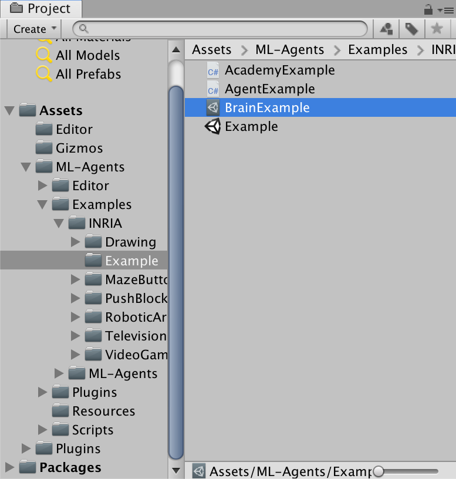
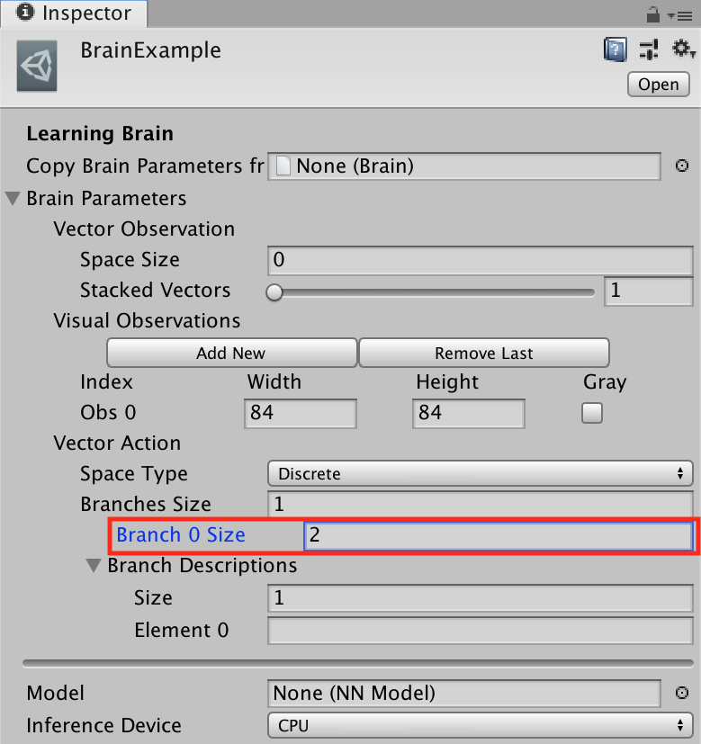
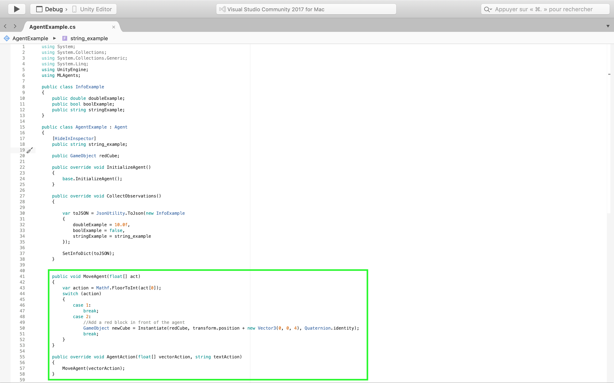
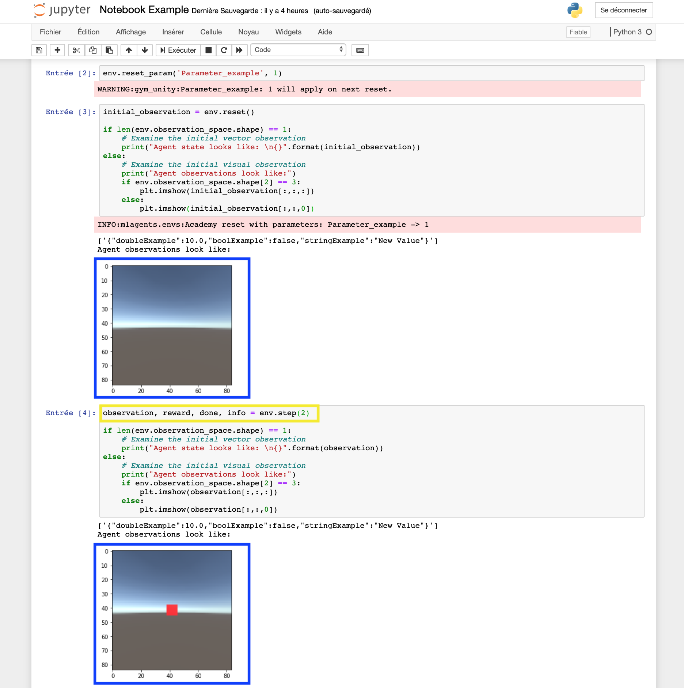

# Change an environment during a simulation

The best way to modify an environment during a simulation is to add these modifications in the agent behaviors. In this way, the agent has "special" attributes and the user can change the environment dynamically. 

Come back to [home](Home.md)

### Contents

- [Create a class with the Serializable attribute ](#class)

- [Convert to Json and send the class](#convert)

- [Result in Gym-Unity](#result)

- [Next Steps](#next_steps)

  

## <a name="class">Increase the branch size of learning brain</a>

The first step is to increase the branch size of the learning brain. In the section `Vector Action` change the number of `Branch Size` with the number of actions you want to do in the environment : **red block**.

  
  

## <a name="convert">Behavior of the environment</a>

The next step is to add in the `MoveAgent()` function the behavior of the environment when the user will call it with a vector action. In this example, if the user call the action 2, a red block will be instantiate : **green block**.

  

### <a name="result">Result in Gym-Unity</a>

When you will launch the example environment in Gym, you will be able to controll the agent : **Yellow block**. When you send the action 2 and compare the rendering, you observe that a red bock is appeared : **blue block**

  

## <a name="next_steps">Next Steps</a>

If you want to learn more about the new Inria features  :

- [Add informations in the dictionary](Dictionary_Informations.md)
- [Add reset parameters](Reset_parameters.md)

or come back to [home](Home.md)

