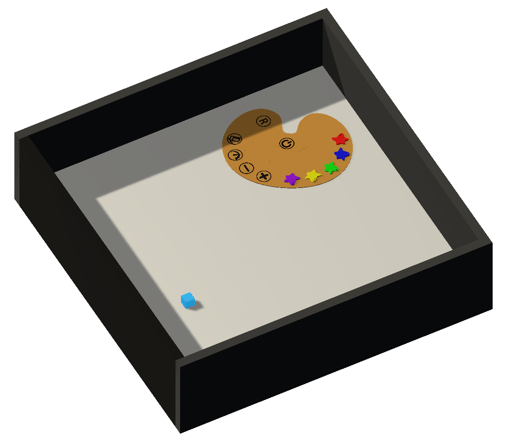

# Drawing

Come back to [home](../Home.md)

### Contents

- [Description](#description)

- [Agent's Actions](#actions)

- [Brain](#brain)

- [Observations](#observations)

- [Reset](#Reset)

- [Reset's Parameters](#parameters)

- [Distraction](#distraction)

- [Next Steps](#next_steps)

  

## <a name="class">Information</a>

  

|            <a name="description">Description</a>             |  The agent can enabled a palette, choose several colors and features, and draw anything on the white floor. He has the choice between 5 colors. He can change the thickness of the brush or take an eraser to delete its drawing. The palette has an option which allows the agent to have its brush thickness depending on its speed. He can observe the scene from the first or the third person point of view  |
| :----------------------------------------------------------: | :----------------------------------------------------------- |
|            <a name="actions">Agent's Actions</a>             | The agent has 11 actions :  nothing (0) / go forward (1) / go backward (2)  nothing (0) / turn left (1) / turn right (2) nothing (0) / drawing (1) nothing (0) / first person point of view (1) / third person point of view (2) |
|                  <a name="brain">Brain</a>                   | The brain has four branches : `observation, reward, done, info = env.step([0,0,0,0])` |
|       <a name="observations">Agent's Observations</a>        | The agent sends its observations (image 84x84) at each step  |
| <a name="informations">Informations stored in a dictionary</a> | The agent stores its **position**, its **point of view**, the **features** and **colors** of the brush and if the palette **is enabled or not** at each step |
|                  <a name="Reset">Reset</a>                   |  If the user wants to reset the environment. He can choose to **enable the palette**,  **configure the brush** and the **point of view** at the beginning of the simulation.  |
|         <a name="parameters">Reset's Parameters</a>          |  **Red [0, 1]** : 0 disable the red color ; 1 enable the red color  **Blue [0, 1]** : 0 disable the blue color ; 1 enable the blue color  **Green [0, 1]** : 0 disable the green color ; 1 enable the green color  **Yellow [0, 1]** : 0 disable the yellow color ; 1 enable the yellow color  **Purple [0, 1]** : 0 disable the purple color ; 1 enable the purple color  **Option [0, 3]** : 0 disable all options ; 1 enable the palette ; 2 enable the option eraser ; 3 enable the option brush thickness depending on speed   **Camera [0, 1]** : 0 first person point of view ; 1 third person point of view    |
|            <a name="distraction">Distraction</a>             | None                                                         |

## <a name="next_steps">Next Steps</a>

Other environments : 

1. [PushBlocks](PushBlocks.md)
2. [Television](Television.md)
3. [MazeButtons (colored)](MazeButtonsColored.md)
4. [MazeButtons (textured)](MazeButtonsTextured.md)
5. [Drawing](Drawing.md)
6. [VideoGame](VideoGame)

or come back to [home](../Home.md)