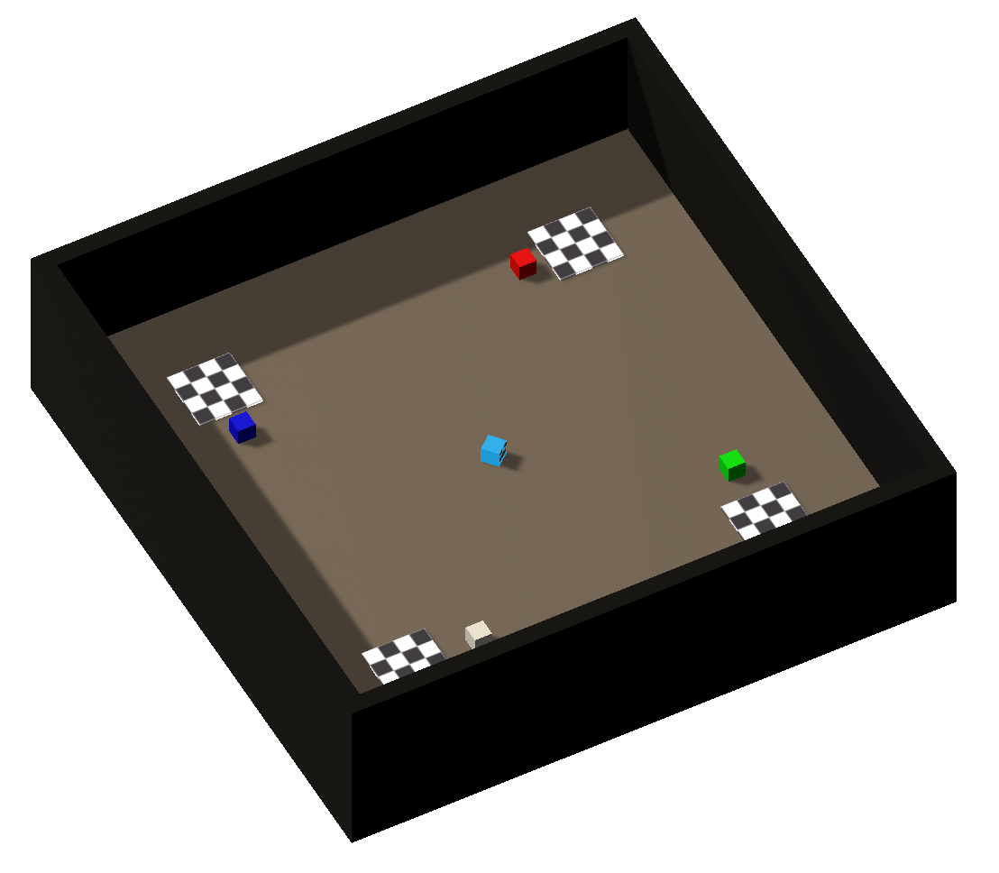

# PushBlocks

Come back to [home](../Home.md)

### Contents

- [Description](#description)

- [Agent's Actions](#actions)

- [Brain](#brain)

- [Observations](#observations)

- [Reset](#Reset)

- [Reset's Parameters](#parameters)

- [Distraction](#distraction)

- [Next Steps](#next_steps)

  

## <a name="class">Information</a>

  

|            <a name="description">Description</a>             |  The agent can move colored blocks. If it pushes a block in one of the squarred areas, the walls of the room take the color of the block. If there are more than one cube in the squarred areas, the colors add-up. If the agent pushes a block out of a squarred area, its color is substracted.  |
| :----------------------------------------------------------: | :----------------------------------------------------------- |
|            <a name="actions">Agent's Actions</a>             | The agent has 5 actions : nothing (0) / go forward (1) / go backward (2) / turn left (3) / turn right (4) |
|                  <a name="brain">Brain</a>                   | The brain has only one branch : `observation, reward, done, info = env.step(0)` |
|       <a name="observations">Agent's Observations</a>        | The agent sends its observations (image 84x84) at each step  |
| <a name="informations">Informations stored in a dictionary</a> | The agent stores its **position** and if whether **there is a block is on a squarred area** at each step |
|                  <a name="Reset">Reset</a>                   |  If the user wants to reset the environment, he can change the parameters. He can choose to **put one or more blocks on a squarred area** at the beginning of the simulation  |
|         <a name="parameters">Reset's Parameters</a>          |  **blueBlock [0, 1]** : 0 remove the blue block of a squarred area ; 1 add the blue block in a squarred area **redBlock [0, 1]** : 0 remove the red block of a squarred area ; 1 add the red block in a squarred area **greenBlock [0, 1]** : 0 remove the green block of a squarred area ; 1 add the green block in a squarred area **orangeBlock [0, 1]** : 0 remove the orange block of a squarred area ; 1 add the orange block in a squarred area  |
|            <a name="distraction">Distraction</a>             | None                                                         |

## <a name="next_steps">Next Steps</a>

Other environments : 

1. [PushBlocks](PushBlocks.md)
2. [Television](Television.md)
3. [MazeButtons (colored)](MazeButtonsColored.md)
4. [MazeButtons (textured)](MazeButtonsTextured.md)
5. [Drawing](Drawing.md)
6. [VideoGame](VideoGame)

or come back to [home](../Home.md)