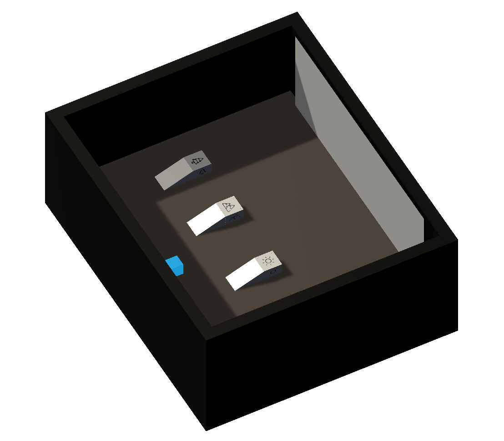

# Television

Come back to [home](../Home.md)

### Contents

- [Description](#description)

- [Agent's Actions](#actions)

- [Brain](#brain)

- [Observations](#observations)

- [Reset](#Reset)

- [Reset's Parameters](#parameters)

- [Distraction](#distraction)

- [Next Steps](#next_steps)

  

## <a name="class">Information</a>

  

|            <a name="description">Description</a>             |  The agent can enabled buttons to create an image on a screen. There are 3 buttons that enable or disable a part of an image. There is also a switch that changes the kind of image. When the agent enables a button or the switch, the color of them change and particules appear in order to distract the agent.  |
| :----------------------------------------------------------: | :----------------------------------------------------------- |
|            <a name="actions">Agent's Actions</a>             | The agent has 5 actions : nothing (0) / go forward (1) / go backward (2) / turn left (3) / turn right (4) |
|                  <a name="brain">Brain</a>                   | The brain has only one branch : `observation, reward, done, info = env.step(0)` |
|       <a name="observations">Agent's Observations</a>        | The agent sends its observations (image 84x84) at each step  |
| <a name="informations">Informations stored in a dictionary</a> | The agent stores its **position**, if whether a **button is enabled** and the **number of the image** displayed at each step |
|                  <a name="Reset">Reset</a>                   |  If the user wants to reset the environment, he can change the parameters. He can choose to **enable one or more buttons** and which **image will be displayed** at the beginning of the simulation.  |
|         <a name="parameters">Reset's Parameters</a>          |  **firstButton [0, 1]** : 0 disable the button ; 1 enable the button **secondButton [0, 1]** : 0 disable the button ; 1 enable the button **thirdButton [0, 1]** : 0 disable the button ; 1 enable the button **switch [0, 2]** : 1 display the first image ; 2 display the second image : 3 display the third image  |
|            <a name="distraction">Distraction</a>             | **Particles** when the buttons are enabled                   |

## <a name="next_steps">Next Steps</a>

Other environments : 

1. [PushBlocks](PushBlocks.md)
2. [Television](Television.md)
3. [MazeButtons (colored)](MazeButtonsColored.md)
4. [MazeButtons (textured)](MazeButtonsTextured.md)
5. [Drawing](Drawing.md)
6. [VideoGame](VideoGame)

or come back to [home](../Home.md)