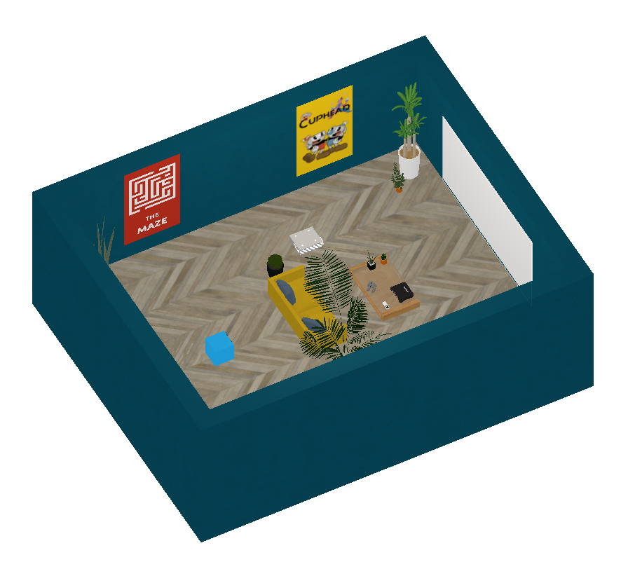

# VideoGame

Come back to [home](../Home.md)

### Contents

- [Description](#description)

- [Agent's Actions](#actions)

- [Brain](#brain)

- [Observations](#observations)

- [Reset](#Reset)

- [Reset's Parameters](#parameters)

- [Distraction](#distraction)

- [Next Steps](#next_steps)

  

## <a name="class">Information</a>

  

|            <a name="description">Description</a>             |  The agent can play 7 games : a maze, a tetris, a space invaders, a pong, a platform game, Cuphead and a random game. The agent has different actions depending on the game. For example, in the platform game, the agent can make the player jump, go left and right, climb a ladder and enable objects. In tetris, the agent can turn the tetrominos and speed up their descent. If the agent is not in front of the screen, the game pauses. To start a game, it has to enable the projector with a remote controller and catch a game in front of it poster.  |
| :----------------------------------------------------------: | :----------------------------------------------------------- |
|            <a name="actions">Agent's Actions</a>             |  The agent has 13 actions :  nothing (0) / go forward (1) / go backward (2) / turn left (3) / turn right (4) / enable something (5) / gamecontroller button up (6) / gamecontroller button down (7) / gamecontroller button left (8) / gamecontroller button right (9) / gamecontroller button A (10) / gamecontroller button B (11) / gamecontroller button start (12)  |
|                  <a name="brain">Brain</a>                   | The brain has only one branch : `observation, reward, done, info = env.step(0)` |
|       <a name="observations">Agent's Observations</a>        | The agent sends its observations (image 84x84) at each step  |
| <a name="informations">Informations stored in a dictionary</a> | The agent stores its **position**, the **name of the game loaded** and whether it is **playing or not** at each step |
|                  <a name="Reset">Reset</a>                   |  If the user wants to reset the environment. He can choose to **launch a game** at the beginning of the simulation.  |
|         <a name="parameters">Reset's Parameters</a>          | **load_game [0, 8]** : 0 none game is launched ; 1-8 launch a game at the beginning of the simulation |
|            <a name="distraction">Distraction</a>             | Some distractions are present in the games                   |

### The maze

This game allows the agent to move a ball in a maze. The agent see the maze at the third point of view, can move the ball forward and backward, left and right. There is a timer on the left of the screen that stops when the ball touch the coin in the maze (end).

### Tetris

This game is a simple tetris game. The agent can turn the tetrominos, speed up their falling and move them left or right. Each line maked by the tetrominos increase the score by 1.

### Space Invaders

This game is a classical Space Invaders but more difficult. The agent can control a space ship that can go forward, backward, left and right, and shoot a laser. The space ship has to avoid or destroy meteors or aliens. The score increase according to the object destroy. Each object has specifics speed and features.

### Pong

The original pong game. The agent control a paddle that can go forward and backward. It plays against a simple AI. The first which reaches 3 points wins

### Platform game

This game allow to the agent to control a character that explores a world. In this world, the character has to move objects and resolve simple puzzles. There are 2 levels. The character can go left and right, jump, climb a ladder and do actions.

### Cuphead

In this environment, the agent can not control anything. It is a simple video that shows the game Cuphead designed with the software Unity.

### Random Game

In this environment, no matter the actions of the agent, the behaviors are random. It shows to the agent severals balls. When the agent does an action, the balls can grow, shrink, be destroyed or change thier color.

## <a name="next_steps">Next Steps</a>

Other environments : 

1. [PushBlocks](PushBlocks.md)
2. [Television](Television.md)
3. [MazeButtons (colored)](MazeButtonsColored.md)
4. [MazeButtons (textured)](MazeButtonsTextured.md)
5. [Drawing](Drawing.md)
6. [VideoGame](VideoGame)

or come back to [home](../Home.md)