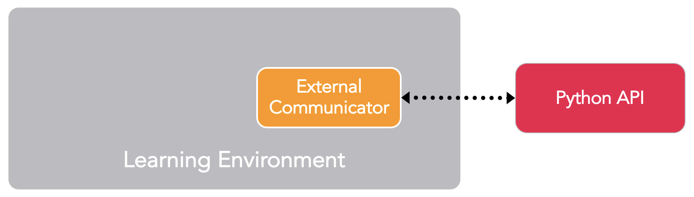

# ML-Agents Toolkit Overview

The second part of the documentation is for the users who want to modify the last or the new environments, or create new environments. The Unity version selected is available for Linux and Mac.

Come back to [home](Home.md)

### Contents

- [Reinforcement Learning Example: Training NPC Behaviors](#example)
- [Key Components](#key)
- [Next Steps](#next_steps)

**The Unity Machine Learning Agents Toolkit** (ML-Agents Toolkit) is an open-source Unity plugin that enables games and simulations to serve as environments for training intelligent agents. Agents can be trained using reinforcement learning, imitation learning, neuroevolution, or other machine learning methods through a simple-to-use Python API. 

This ML-Agents repository is beneficial for AI researchers as it provides a central platform where  advances in AI can be evaluated on Unity’s rich environments and then made accessible to the wider research and game developer communities.

The remainder of this page contains a deep dive into ML-Agents, its key components, different training modes and scenarios. By the end of it, you should have a good sense of what the ML-Agents toolkit allows you to do. The subsequent documentation pages provide examples of how to use ML-Agents.

## <a name="example">Reinforcement Learning Example: Training NPC Behaviors</a>

To help explain the material and terminology in this page, we'll use a hypothetical, running example throughout. We will explore the problem of  training the behavior of a non-playable character (NPC) in a game. (An NPC is a game character that is never controlled by a human player and its behavior is pre-defined by the game developer.) More specifically, let's assume we're building a multi-player, war-themed game in which players control the soldiers. In this game, we have a single NPC who serves as a medic, finding and reviving wounded players. Lastly, let us assume that there are two teams, each with five players and one NPC medic.

The behavior of a medic is quite complex. It first needs to avoid getting injured, which requires detecting when it is in danger and moving to a safe location. Second, it needs to be aware of which of its team members are injured and require assistance. In the case of multiple injuries, it needs to assess the degree of injury and decide who to help first. Lastly, a good medic will always place itself in a position where it can quickly help its team members. Factoring in all of these traits means that at every instance, the medic needs to measure  several attributes of the environment (e.g. position of team members, position of enemies, which of its team members are injured and to what degree) and then decide on an action (e.g. hide from enemy fire, move to help one of its members). Given the large number of settings of the environment and the large number of actions that the medic can take, defining and implementing such
complex behaviors by hand is challenging and prone to errors.

With ML-Agents, it is possible to _train_ the behaviors of such NPCs (called agents**) using a variety of methods. The basic idea is quite simple. We need to define three entities at every moment of the game (called **environment**):

- **Observations** - what the medic perceives about the environment. Observations can be numeric and/or visual. Numeric observations measure attributes of the environment from the point of view of the agent. For our medic this would be attributes of the battlefield that are visible to it. For most interesting environments, an agent will require several continuous numeric observations. Visual observations, on the other hand, are images generated from the cameras attached to the agent and represent what the agent is seeing at that point in time. It is common to confuse an agent's observation with the environment (or game) **state**. The environment state represents information about the entire scene containing all the game characters. The agents observation, however, only contains information that
  the agent is aware of and is typically a subset of the environment state. For example, the medic observation cannot include information about an enemy in hiding that the medic is unaware of.
- **Actions** - what actions the medic can take. Similar to observations, actions can either be continuous or discrete depending on the complexity of the environment and agent. In the case of the medic, if the environment is a simple grid world where only their location matters, then a discrete action taking on one of four values (north, south, east, west) suffices. However, if the environment is more complex and the medic can move freely then using two continuous actions (one for direction and another for speed) is more appropriate.
- **Reward signals** - a scalar value indicating how well the medic is doing. Note that the reward signal need not be provided at every moment, but only when the medic performs an action that is good or bad. For example, it can receive a large negative reward if it dies, a modest positive reward whenever it revives a wounded team member, and a modest negative reward when a wounded team member dies due to lack of assistance.

After defining these three entities (the building blocks of a **reinforcement learning task**), we can now _train_ the medic's behavior. This is achieved by simulating the environment for many trials where the medic, over time, learns what is the optimal action to take for every observation it measures by maximizing its future reward. The key is that by learning the actions that maximize its reward, the medic is learning the behaviors that make it a good medic (i.e. one who saves the most number of lives). In **reinforcement learning** terminology, the behavior that is learned is called a **policy**, which is essentially a (optimal) mapping from observations to actions. Note that the process of learning a policy through running simulations is called the
**training phase**, while playing the game with an NPC that is using its learned policy is called the **inference phase**.

The ML-Agents toolkit provides all the necessary tools for using Unity as the simulation engine for learning the policies of different objects in a Unity environment. In the next few sections, we discuss how the ML-Agents toolkit achieves this and what features it provides.

The Inria provides environments without goal. The agent can explore or do what it wants. He has not reward to maximize. These environments are different from the initial environments provide by ML-Agents. They are especially used used for curiosity learning.

## <a name="key">Key Components</a>

The ML-Agents toolkit is a Unity plugin that contains three high-level components:

- **Learning Environment** - which contains the Unity scene and all the game characters.
- **Python API** - which contains all the machine learning algorithms that are used for training (learning a behavior or policy). Note that, unlike the Learning Environment, the Python API is not part of Unity, but lives outside and communicates with Unity through the External Communicator.
- **External Communicator** - which connects the Learning Environment with the Python API. It lives within the Learning Environment.

  

_Simplified block diagram of ML-Agents._

The Learning Environment contains three additional components that help organize the Unity scene:

- **Agents** - which is attached to a Unity GameObject (any character within a scene) and handles generating its observations and performing the actions it receives when appropriate. Each Agent is linked to exactly one Brain.
- **Brains** - which encapsulates the logic for making decisions for the Agent. In essence, the Brain is what holds on to the policy for each Agent and determines which actions the Agent should take at each instance. More specifically, it is the component that receives the observations and rewards from the Agent and returns an action.
- **Academy** - which orchestrates the observation and decision making process. Within the Academy, several environment-wide parameters such as the rendering quality and the speed at which the environment is run can be specified. The External Communicator lives within the Academy.

Every Learning Environment will always have one global Academy and one Agent for every character in the scene. While each Agent must be linked to a Brain, it is possible for Agents that have similar observations and actions to be linked to the same Brain. In our sample game, we have two teams each with their own medic. Thus we will have two Agents in our Learning Environment, one for each medic, but both of these medics can be linked to the same Brain. Note that these two medics are linked to the same Brain because their _space_ of observations and actions are similar. This does not mean that at each instance they will have
identical observation and action _values_. In other words, the Brain defines the space of all possible observations and actions, while the Agents connected to it (in this case the medics) can each have their own, unique observation and action values. If we expanded our game to include tank driver NPCs, then the Agent attached to those characters cannot share a Brain with the Agent linked to the medics (medics and drivers have different actions).

  

_Example block diagram of ML-Agents toolkit for our sample game._

We have yet to discuss how the ML-Agents toolkit trains behaviors, and what role the Python API and External Communicator play. Before we dive into those details, let's summarize the earlier components. Each character is attached to an Agent, and each Agent is linked to a Brain. The Brain receives observations and rewards from the Agent and returns actions. The Academy ensures that all the Agents and Brains are in sync in addition to controlling environment-wide settings. So how does the Brain control what the Agent does?

In practice, we have three different categories of Brains, which enable a wide range of training and inference scenarios:

- **Learning** - where decisions are made using an embedded TensorFlow model. The embedded TensorFlow modelrepresents a learned policy and the Brain directly uses this model to determine the action for each Agent. You can train a **Learning Brain** by dragging it into the Academy's `Broadcast Hub` with the `Control` checkbox checked.
- **Player** - where decisions are made using real input from a keyboard or controller. Here, a human player is controlling the Agent and the observations and rewards collected by the Brain are not used to control the Agent.
- **Heuristic** - where decisions are made using hard-coded behavior. This resembles how most character behaviors are currently defined and can be helpful for debugging or comparing how an Agent with hard-coded rules compares to an Agent whose behavior has been trained. In our example, once we have trained a Brain for the medics we could assign a medic on one team to the trained Brain and assign the medic on the other team a Heuristic Brain with hard-coded behaviors. We can then evaluate which medic is more effective.

  

_An example of how a scene containing multiple Agents and Brains might be configured._

## <a name="next_steps">Next Steps</a>

To briefly summarize: The ML-Agents toolkit enables games and simulations built in Unity to serve as the platform for training intelligent agents. It is designed to enable a large variety of training modes and scenarios and comes packed with several features to enable researchers and developers to leverage (and enhance) machine learning within Unity.

If you want to learn more about the key components :

* [Agent](Agent.md)
* [Brains](Brains.md)
* [Academy](Academy.md)

The Flowers team has adapted ML-Agents to fit with its work, [find out the new features](Dictionary_Informations.md)

or come back to [home](Home.md)

