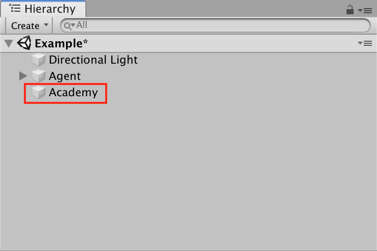
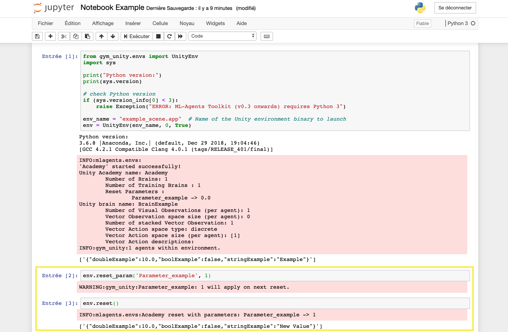

# Add reset parameters

In order to be able to configure an environment before a reset, several manipulations must be done in Unity.

Come back to [home](Home.md)

### Contents

- [Modification of the Academy object ](#academy)

- [Creation of a behavior depending on the value of a parameter](#behavior)

- [Result in Gym-Unity](#result)

- [Next Steps](#next_steps)

  

## <a name="academy">Modification of the Academy object</a>

The first step is to add, in the script of the academy object, a new `Reset Parameters` : **red block**. Then, you have to name this parameter. This name will be used in Gym to change the value of the parameter before the reset : : **green block**. Then, create a class with the serializable attribute . 

  
    

## <a name="behavior">Creation of a behavior depending on the value of a parameter</a>

The next step is to create a behavior in the script of the academy extending the Academy class depending on the value of a parameter. In this example, we change the value of an information stored in the dictionary. We read the value of `Parameter_example` and change the behavior depending on it : **blue block**.

  

### <a name="result">Result in Gym-Unity</a>

When you will launch the environment in Gym, you will can change the parameter of reset. Then, the environment will start with a new behavior  : **Yellow block**.

  

## <a name="next_steps">Next Steps</a>

If you want to learn more about the new Inria features  :

- [Add informations in the dictionary](Dictionary_Informations.md)
- [Change an environment during a simulation](Environment_modification.md)

or come back to [home](Home.md)