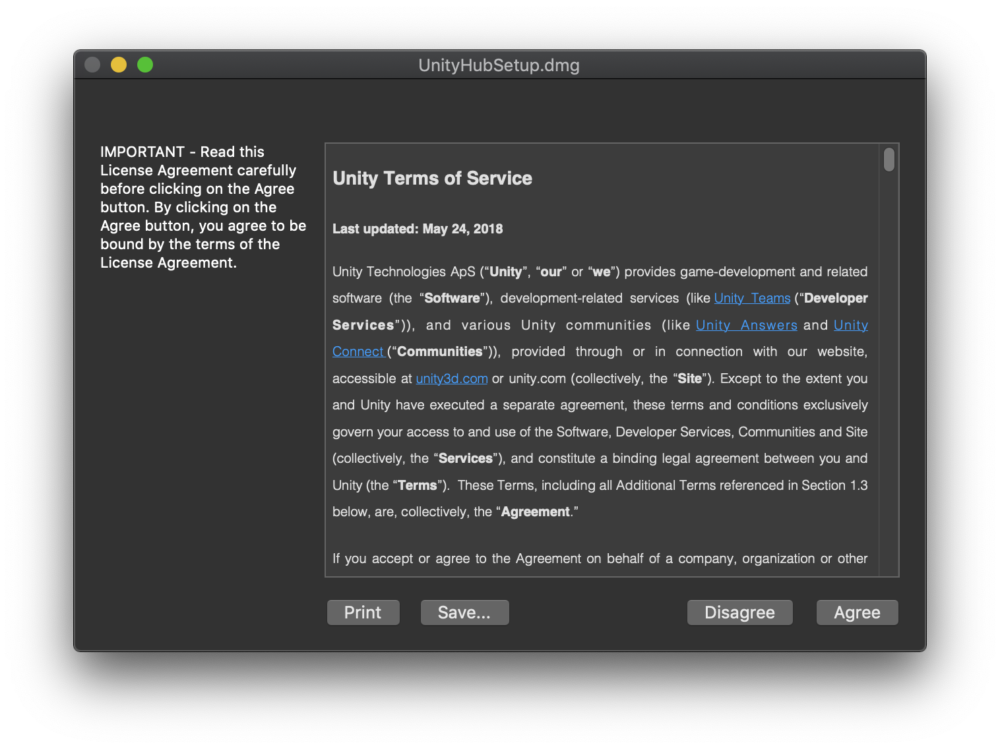
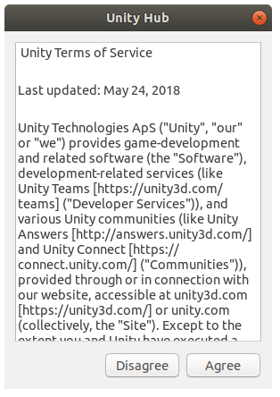
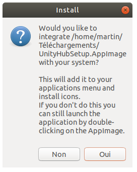
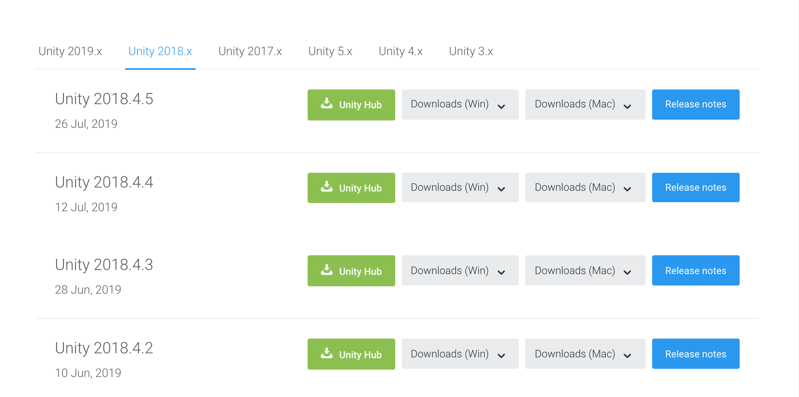
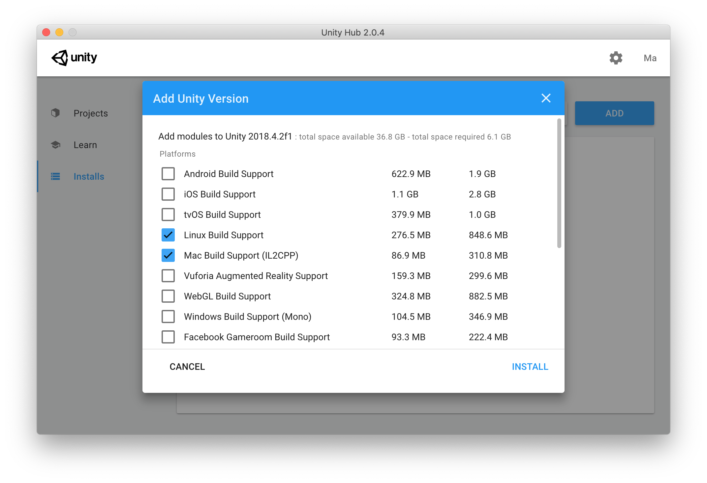
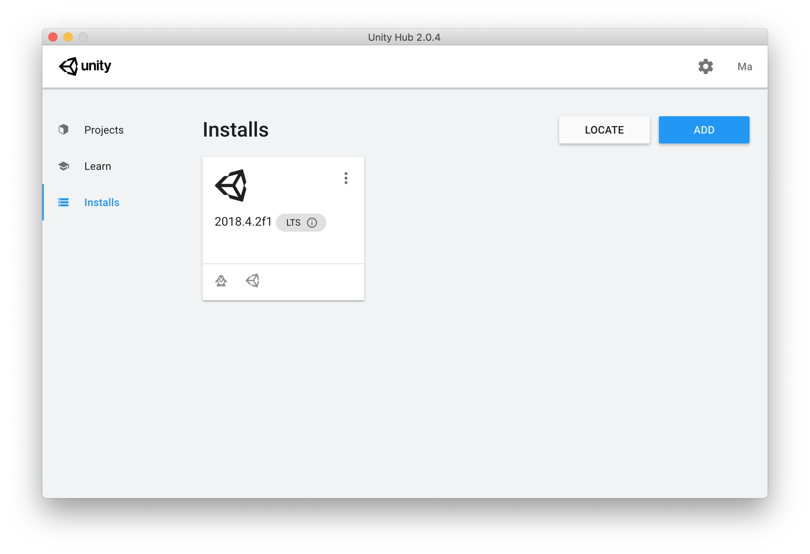

# Unity Installation

The second part of the documentation is for the users who want to modify the last or the new environments, or create new environments. The Unity version selected is available for Linux and Mac.

Come back to [home](Home.md)

### Contents

- [Recommendation](#recommendation)
- [Install Unity Hub](#hub)
- [Install Unity](#unity)
- [Next Step](#next_step)


## <a name="recommendation">Recommendation</a>

All of the environments have been designed with `Unity 2018.4.2f1`. We recommend to install the same version. If you install an other version you can meet a compatibility problem.

We also recommend to learn how to use Unity with these tutorials available on the Unity website :

* [Interactive Tutorials](https://unity3d.com/fr/learn/tutorials/s/interactive-tutorials)
* [Roll-a-ball tutorial](https://unity3d.com/fr/learn/tutorials/s/roll-ball-tutorial)
* [Space Shooter tutorial](https://unity3d.com/fr/learn/tutorials/s/space-shooter-tutorial)


## <a name="hub">Install Unity Hub</a>

The first step is to download and install the Unity Hub which allows to download any Unity version and open projects. [Download the Unity Hub](https://forum.unity.com/threads/unity-hub-v2-0-0-release.677485/)

### Mac User

Double-click the downloaded file and click agree to start the installation.

<p align="center">
  
</p>

Click and drag the Unity Hub.app icon in the Applications folder.

<p align="center">
  
</p>

Unity Hub is now install.

### Linux User

Save the downloaded file in a folder for the installation. Open a terminal and go in the folder where you place the downloaded file. Enter the next command that allows you to give execute permission to the `UnityHubSetup.AppImage`

```bash
sudo chmod +x UnityHubSetup.AppImage
```

Then run the setup file with the command 

```bash
./UnityHubSetup.AppImage
```

Accept the licence and Answer `Yes` to the next window.

<p align="center">
  
  
</p>

Unity Hub is now install.

## <a name="unity">Install Unity</a>

Once installed open Unity Hub and click on `Installs` in the list on the left

<p align="center">
  
</p>

Click on the button `ADD` on the left top and on `Official Releases website` in the new window.

<p align="center">
  
</p>

A web page should be opened, click `Unity 2018.x` and on the `Unity Hub` button in `Unity 2018.4.2`

<p align="center">
  
</p>

In the new window, choose the options `Linux Build Support` and `Mac Build Support` and click on the button `Install`. Wait until the installation title become black. Unity is now install.

<p align="center">
  
  
</p>

## <a name="next_step">Next Step</a>

The next step show you how to [run the unity project](Unity_project.md) and how the project is organized

or come back to [home](Home.md)

