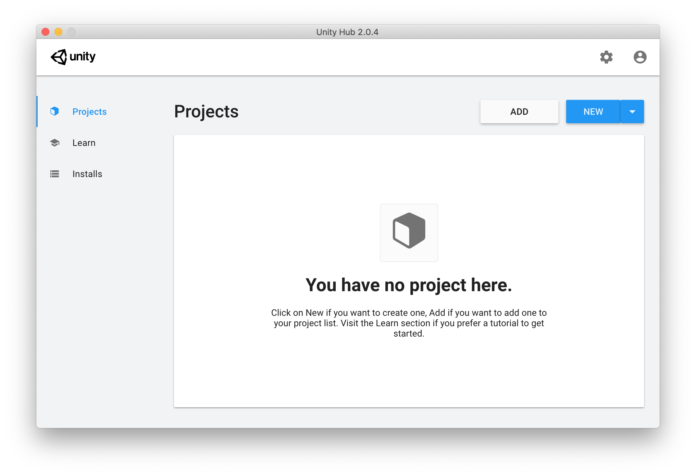
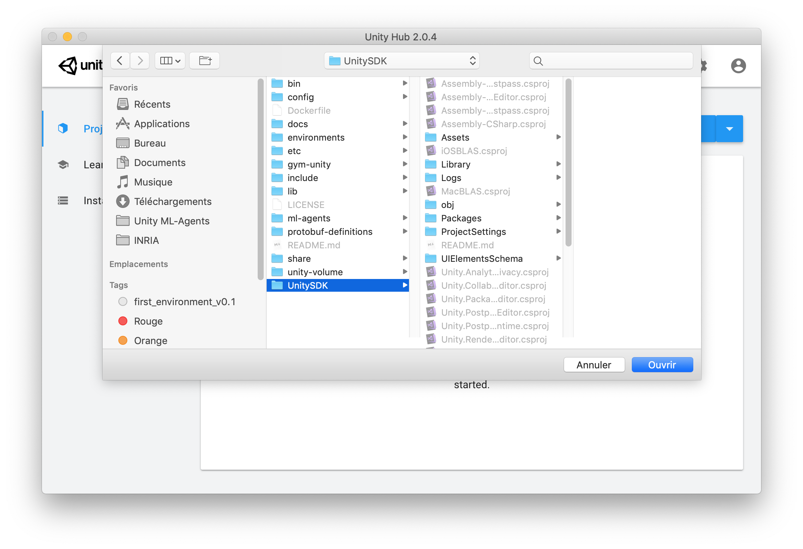
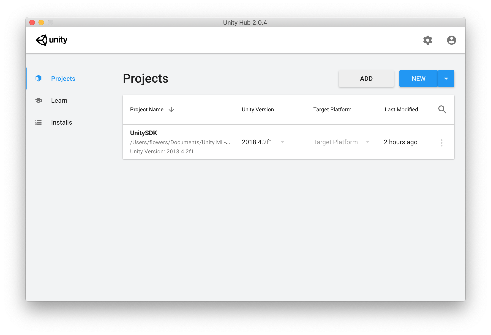
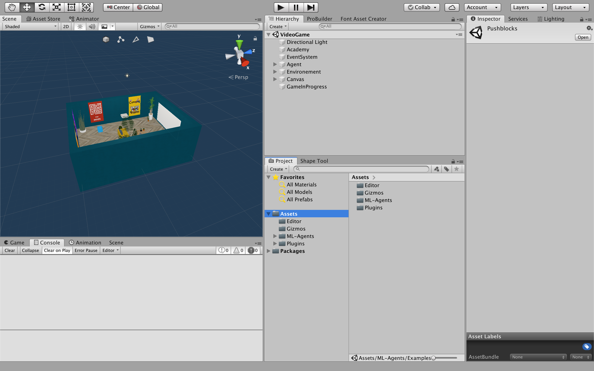
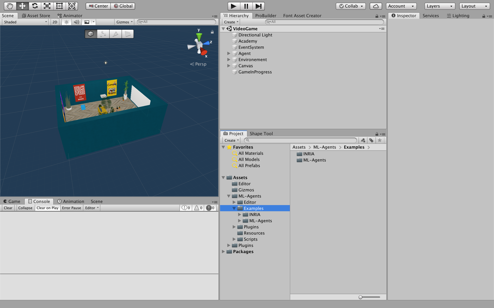
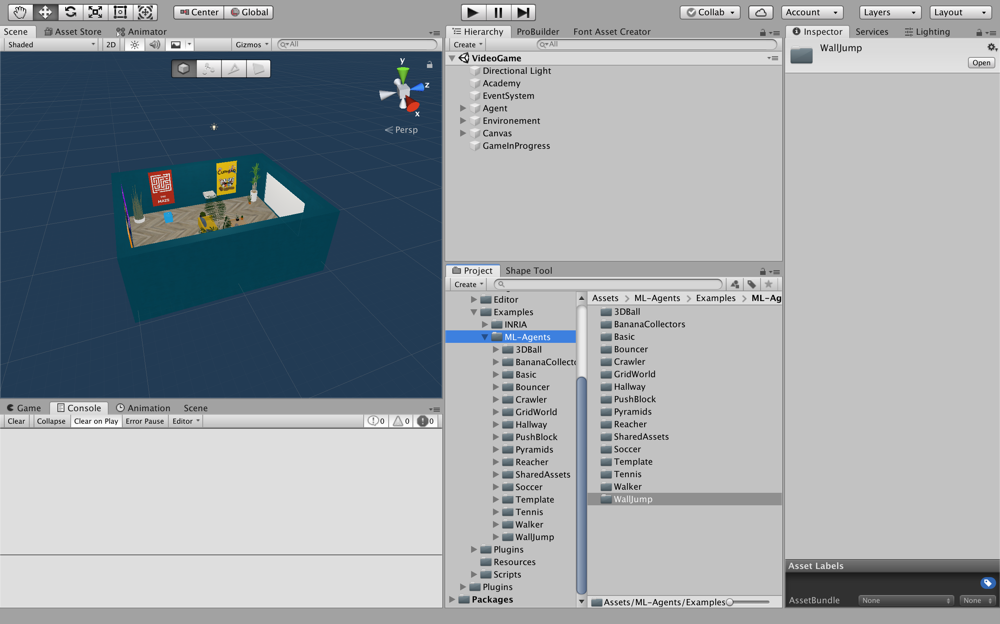
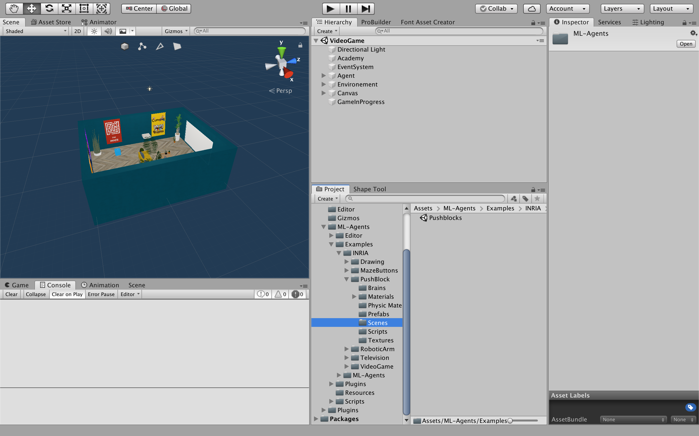
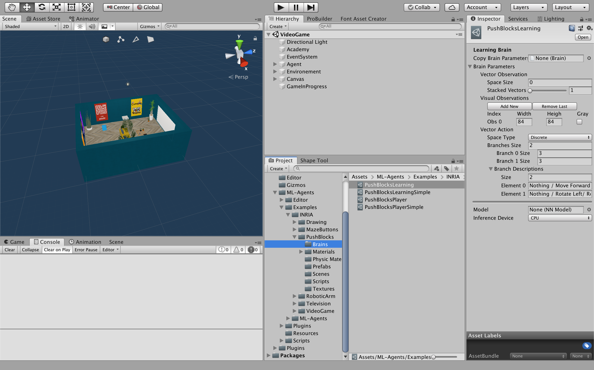
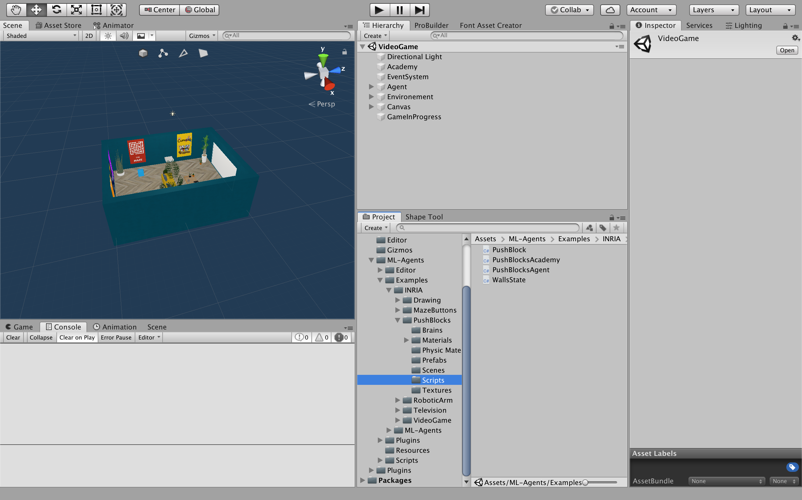

# Unity SDK and project organization

Now, we're seeing how to launch the project and how it os organized.

Come back to [home](Home.md)

### Contents

- [Open the project](#open_project)
- [Organization](#organization)
  - [ML-Agents initial environments](#initial)
  - [Inria new environments](#new)
- [Next Step](#next_step)

## <a name="open_project">Open the project</a>

Open Unity Hub and go on the section `Projects`. 

  

Click on the button `ADD` and go in the repository ml-agents. Then, click on the folder `UnitySDK` and on the button `Open` at the bottom right of the window.

  

The project is added in the Projects list. Click on the project in the list to open it.

  

## <a name="organization">Organization</a>

When the project is open, you should have in the window `Project` this kind of structure : 

  

Now, we are going to explain how the project is structured : 

* The `Assets` folder contains all the elements used in the project (scene, texture, object, etc.)
* The `Packages` folder contains all the packages used in the project (TextMesh Pro, Shader Graph, etc.)

Unroll the `ML-Agents`folder then unroll the `Examples` folder. You have 2 folders : 

* `INRIA` : providing the environments designed by Inria
* `ML-Agents` : providing the initial environments designed by ML-Agents

  

### <a name="initial">ML-Agents initial environments</a>

The folder `ML-Agents` contains 16 simple environments provided by ML-Agents. To learn more about theses environments visit the ML-Agents [documentation](ML-Agents_documentation/docs/Learning-Environment-Examples.md). 

  

### <a name="new">Inria new environments</a>

The folder `INRIA` contains the environments designed by the Inria. All of these environments do not have goal : the agent can do what it want. Each environment folder contains other folders with

* Textures
* 3D model
* Prefabs
* Materials
* Scripts
* Scenes
* etc. depending on the environment

To load an environment, click on the `Scenes` folder and double click on the scene in the folder.

  

In the `Brains` folders you will find several kind of brains (different action size and shape). Each brain is linked to the agent of a specific environment. 

The `Scripts` folders contain scripts of Academies and Agents, obligatory for the using of ML-Agents.

  
  

## <a name="next_step">Next Step</a>

The next step explain [how works ML-Agents and these components](ML-Agents_Overview.md),

or come back to [home](Home.md)
